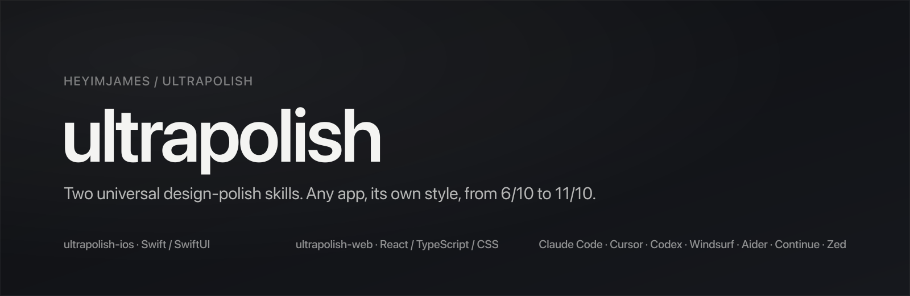

<p align="center">
  
</p>

# ultrapolish

Two universal design-polish skills that take any app from 6/10 to 11/10 on attention to detail, UX, and cohesion, inside its own visual style.

<p align="center">
  <a href="#install"></a>
  <a href="https://github.com/heyimjames/ultrapolish/stargazers"></a>
</p>

<p align="center">
  
  
  
  <a href="https://skills.sh/heyimjames/ultrapolish"></a>
  <a href="LICENSE"></a>
  
</p>

> Not a style. A craft standard and a procedure.
> It reads your tokens first, then makes what is already there feel considered, continuous, and alive.

---

## What this is

Most "make it look good" prompts give you a second style that fights the first: a new font, a purple gradient, a breathing icon, confetti on save. ultrapolish does the opposite. It starts by inventorying the project's own type, colour, radii, spacing, motion, and copy, then applies a universal standard of detail inside that system.

- **Any app.** A dense data tool, an editorial reading app, a playful consumer product. The rules are about frequency, hierarchy, continuity, and states, not about a look.
- **Its own style.** The skill never introduces a palette, a typeface, or a motion personality. If the project has no system, it proposes a fifteen-line design contract first and works inside it.
- **6/10 to 11/10.** The difference is the last five percent: the spinner that appears where the result will land, the exit that is faster than the entrance, the number that does not shift the layout, the sheet that inherits the tint of the screen beneath it, the error that appears next to the field.

## What's in here

| Skill | For | Covers | Lines |
|---|---|---|---|
| [**ultrapolish-ios**](skills/ultrapolish-ios/SKILL.md) | Swift / SwiftUI (UIKit where it matters) | Motion and springs, gestures and physics, colour (OKLCH, Display P3, dark mode), typography and Dynamic Type, 4pt layout, hierarchy, buttons, sheets and detents, navigation, haptics, sound, SF Symbols, copy and naming, empty/loading/error states, onboarding, paywalls and StoreKit, widgets, Live Activities, Dynamic Island, Liquid Glass, accessibility | ~4672 |
| [**ultrapolish-web**](skills/ultrapolish-web/SKILL.md) | React / TypeScript / CSS (Tailwind and Motion noted, never required) | Easing and springs (`linear()`), gestures and scroll, colour (OKLCH, APCA, theming), typography, 4px layout, surfaces and depth, buttons, forms, overlays, haptics and sound on the web, icons, copy, states, onboarding and pricing, touch and mobile web, performance as a design property, accessibility, marketing pages | ~4954 |

Each skill is a lean `SKILL.md` (the workflow, the ten laws, every cheat-sheet number, the anti-pattern list, a 90-item checklist, and a decisions register) plus ~20 topic references loaded on demand, plus a handful of style-neutral drop-in files (`Motion.swift`, `PressableButtonStyle.swift`, `motion.css`, `gen-springs.mjs`, `base.css`, and so on).

## Install

### skills CLI (any supported agent)

```bash
npx skills add heyimjames/ultrapolish
```

One skill, one agent, globally:

```bash
npx skills add heyimjames/ultrapolish --skill ultrapolish-ios -a claude-code -g
npx skills add heyimjames/ultrapolish --skill ultrapolish-web -a cursor -g
```

### Claude Code (plugin marketplace)

```
/plugin marketplace add heyimjames/ultrapolish
/plugin install ultrapolish@ultrapolish
```

Skills are then namespaced as `ultrapolish:ultrapolish-ios` and `ultrapolish:ultrapolish-web`. Claude Code also auto-invokes them from the trigger words in each description, so you rarely need to type the name.

### Cursor, Codex, Windsurf, Aider, Continue, Zed

```bash
git clone https://github.com/heyimjames/ultrapolish
cd ultrapolish
./install.sh cursor            # project-level .cursor/rules/ (add --global for ~/.cursor/rules/)
./install.sh codex             # appends to ./AGENTS.md (add --global for ~/.codex/AGENTS.md)
./install.sh windsurf          # .windsurfrules
./install.sh aider             # CONVENTIONS.md
./install.sh continue          # .continue/rules/
./install.sh zed               # .rules/
```

These tools have no on-demand loading, so the `dist/` builds inline every reference into one file per skill. `./install.sh <tool> uninstall` removes them.

### Manual

Copy `skills/ultrapolish-ios` or `skills/ultrapolish-web` into `~/.claude/skills/` (or your agent's skills directory). Done.

## How to use

Three prompts cover most of it.

**Audit a screen or a flow**

```
/ultrapolish-ios full audit of the onboarding flow and the paywall
```

**Polish while you build**

```
/ultrapolish-web build mode: add the settings sheet, apply the standard as you go
```

**Write the design contract for a project that has none**

```
/ultrapolish-ios this app has no design system yet; run the intake and propose the contract
```

Every audit returns the same shape, grouped by root cause, with the user-facing consequence spelled out:

| # | Sev | Location | Before | After | What this changes for the user |
|---|-----|----------|--------|-------|--------------------------------|
| 1 | HIGH | `Button.tsx:12` (every button) | Submit disabled until valid | Enabled; validate on submit; focus first invalid field | Users learn what is wrong instead of guessing why the button is dead |
| 2 | HIGH | `ListView.swift:42`, `DetailView.swift:18` | Title animates out on push and back in | Title lives in the parent; only content transitions | The screen feels like one place that changed, not two screens swapped |
| 3 | MED | `theme.css` (token) | Muted text is four hand-picked greys | One ink stepped in alpha (1 / .62 / .45 / .28) | Dark mode flips one base and the hierarchy holds everywhere |
| 4 | MED | `SendButton.swift:31` | Spinner on the tapped button | Progress in the pending bubble at 60% opacity | Eye stays on the message; the app feels faster at the same speed |
| 5 | MED | `Sheet.tsx:8` | Backdrop 200ms ease, panel 300ms spring | Same curve pair; contents enter 80ms after the panel | The sheet arrives as one container with things inside |
| 6 | LOW | `Toast.tsx:22` | Error toast vanishes in 3s | Inline under the field; persists until fixed | Nobody loses the only explanation of what went wrong |

Followed by a "Considered but rejected" table (so restraint is visible), a "Verified how" list, and a verdict: Ship, Needs changes, or Block.

## The ten laws

<table>
<tr><th>ultrapolish-ios</th><th>ultrapolish-web</th></tr>
<tr><td>

1. One datum, one curve
2. Out is faster than in
3. The 100× rule: seen 100 times a day, don't animate it
4. What follows a finger is linear
5. The spinner travels
6. Every state gets equal care
7. Persistent elements never leave and come back
8. A disabled control says why; a destructive action names its noun
9. One accent per view
10. Every number that can change is monospaced and content-transitions

</td><td>

1. One datum, one curve
2. Out is faster than in
3. The 100× rule
4. Opacity never springs; transforms may. Never `transition: all`
5. The spinner travels. Nothing spins before 300ms
6. Every state gets equal care
7. No layout shift, ever
8. A disabled control says why; a destructive action names its noun
9. One accent per view
10. Everyone can reach it: real buttons, visible focus, 24px floor, a name a screen reader can say

</td></tr>
</table>

Where sources disagree (exit easing, press scale, grid, dark-mode black, stagger, reduced motion, toasts), each skill carries a **decisions register** with the position it takes and why. Override any of them in your project's design contract.

## What it will never do

- Introduce a typeface, a palette, a radius language, or a motion personality
- Restyle a project to look like a particular studio, app, or trend
- Add delight to a dense tool that is used 200 times a day
- Treat "when in doubt, animate" as a rule. Motion is earned
- Tell you a colour is wrong. It tells you a contrast is unreadable and how to fix it inside your hue

## Thanks

The thinking here stands on people who wrote it down well: Emil Kowalski on easing and the frequency principle, Benji Taylor on earned motion, Josh Puckett on storyboards and critique, Rauno Freiberg on the web feeling native, and Apple's Designing Fluid Interfaces and Human Interface Guidelines. If you recognise a rule of yours here, it is because it was right.

## Repo layout

```
ultrapolish/
├── skills/
│   ├── ultrapolish-ios/
│   │   ├── SKILL.md              workflow, laws, cheat sheets, checklist, decisions
│   │   ├── references/*.md       one file per topic, loaded on demand
│   │   └── assets/*.swift        Motion, Haptics, PressableButtonStyle, DisplayP3Color, ...
│   └── ultrapolish-web/
│       ├── SKILL.md
│       ├── references/*.md
│       └── assets/               motion.css, gen-springs.mjs, motion.ts, base.css, ...
├── .claude-plugin/               marketplace.json + plugin.json (Claude Code)
├── dist/                         generated per-tool builds, committed so clone-and-install works
├── scripts/build.py              regenerates dist/ (stdlib only)
├── scripts/validate.py           frontmatter, links, assets, line budgets, no em-dashes
├── install.sh                    per-tool installer
└── build.sh
```

## Updating

```bash
git pull
./build.sh all            # only needed if you edit the skills
./install.sh <tool>       # re-copy for Cursor / Codex / Windsurf / Aider / Continue / Zed
```

Claude Code marketplace and `npx skills` installs update through their own commands.

## Contributing

One rule per pull request, with the number and the why. If it contradicts an existing rule, say which one and argue the case; the decisions register exists so that disagreements are recorded, not buried. Run `python3 scripts/validate.py && ./build.sh all` before opening the PR and commit the regenerated `dist/`.

## License

MIT. Use it in anything.

---

Made by [James Frewin](https://jamesfrewin.com) of [October](https://octoberwip.com) · [@james_frewin](https://x.com/james_frewin)
